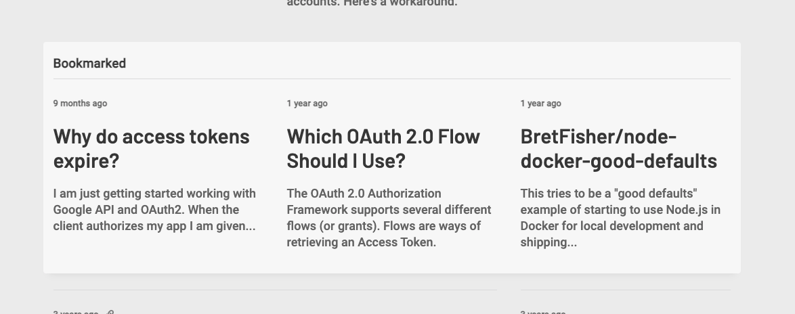

# [Pocket][1] component for [Jekyll][2]

Downloads links saved to Pocket and renders them using a Liquid tag in Jekyll. Links are fetched during build time and multiple lists can be rendered.



## Installation in Jekyll

Add the `jekyll-pocket` gem to your Jekyll website:

```shell
bundle add jekyll-pocket
```

Next, create a private Pocket application by going to the [Pocket API page][4]. Choose the `Retrive` permission and the `Web` platform. Other values can be arbitrary.

Afterwards, download this gem locally. You can do so using `git` or by downloading the project as an archive. You will need to run the [Rake][5] commands it includes to receive an access token for fetching Pocket lists. After downloading the gem locally, run `bundle install` to install the needed gems.

Then run the following commands in order:

```zsh

# 1. 

# Replace your-pocket-app-consumer-key-here with your consumer key.

rake 'jekyll-pocket:get_auth_code[your-pocket-app-consumer-key-here]'

# 2.

# The command will tell to visit a website. Do that and authorize the Pocket app. Authorizing will result in a page not found error. That's expected.

# 3.

# Replace your-pocket-app-consumer-key-here with your consumer key and authentication-code-from-previous-command with the value returned by the first Rake command.

rake 'jekyll-pocket:authorize[your-pocket-app-consumer-key-here,authentication-code-from-previous-command]'

# 4.

# Save the returned access token and consumer token as JEKYLL_POCKET_ACCESS_TOKEN and JEKYLL_POCKET_CONSUMER_KEY environment variables on your server.
```

## Replacing the default template

Create `/_includes/pocket.html` inside your Jekyll project with the custom template based on the default template inside `/lib/_includes/pocket.html` in the gem. The template receives more values from Pocket than the ones used in `/lib/_includes/pocket.html`. These can be used to render an even more customized template.

## Tag options

To render a Pocket list with default options place the following tag in Liquid/HTML:

```

```

To render a Pocket list with custom options use the following syntax:

```

```

The default options are:

```json
{
  "count": 10,
  "offset": 0,
  "tag": null,
  "state": null,
  "favorite": null,
  "sort": null
}
```

[All available options and option values are listed here.][3]

[1]: https://getpocket.com/
[2]: https://jekyllrb.com/
[3]: https://getpocket.com/developer/docs/v3/retrieve
[4]: https://getpocket.com/developer
[5]: https://ruby.github.io/rake/